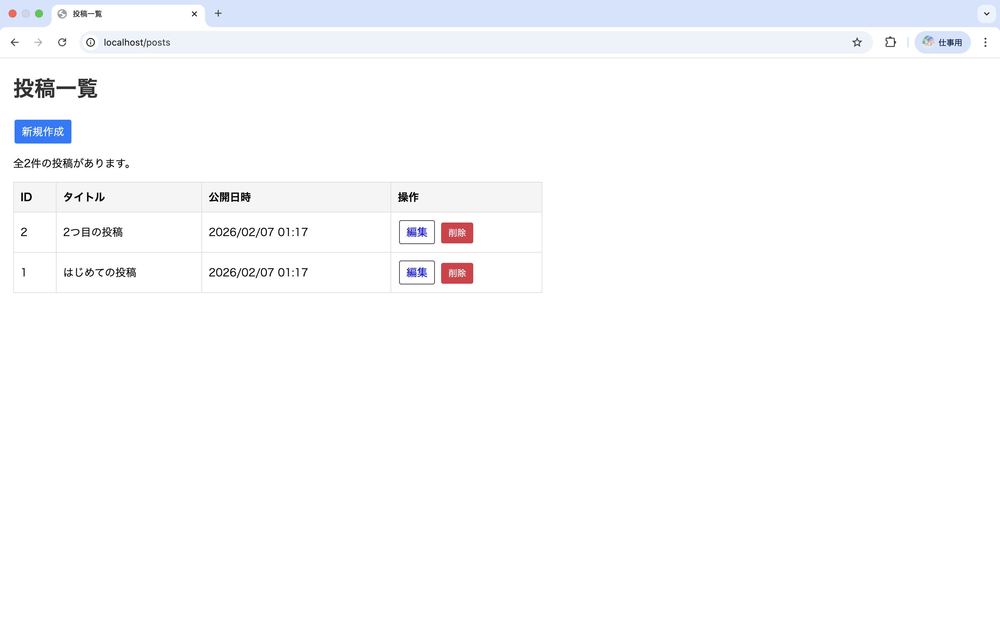
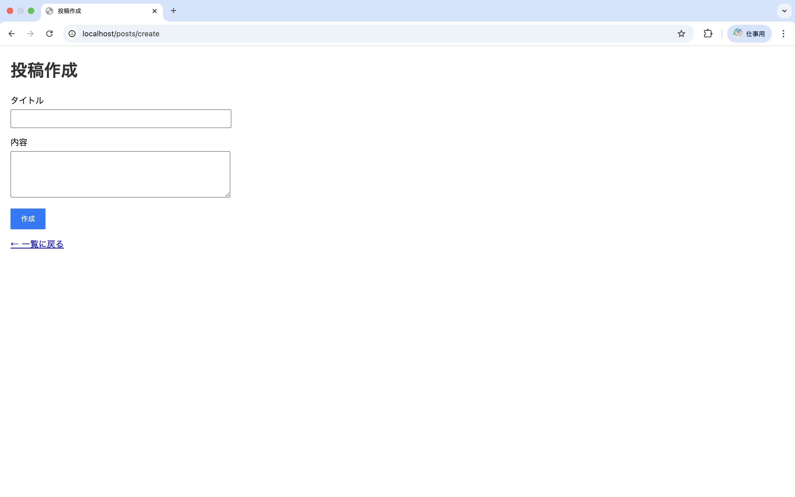

# eloquent-app-practice

## 概要
COACHTECH 教材 Tutorial 9-4「Eloquent ORM ハンズオン演習」で作成した成果物です。
投稿一覧、投稿作成、投稿編集ページを実装した、ブログシステムの投稿一覧機能の作成。

## 使用技術
- PHP 8.x
- Laravel 10.x
- Eloquent ORM
- MySQL

## 学んだこと
- データベースをlaravelで使用する方法。
- 削除された投稿を表示するための方法。

## 動作確認
- sail up -dでのDockerの起動。
- ブラウザで [http://localhost/posts](http://localhost/posts) に接続しLaravelウェルカムページが表示される。

## 詰まったポイントと解放方法
- マイグレーションを作成する際に、どのような型で定義するのかわからないケースがあった。
- 削除された投稿を表示する方法。
    soft deleteの使用。Modelに記述する。
    マイグレーションに$table->softDeletes();の追加。
    Controllerの記述。
    ```
    public function trash()
    {
        $posts = Post::onlyTrashed()->get();
        return view('posts.trash', compact('posts'));
    }
    ```

## 工夫したポイント
- 削除された投稿を表示する方法を追加

## 動作確認のスクリーンショット


